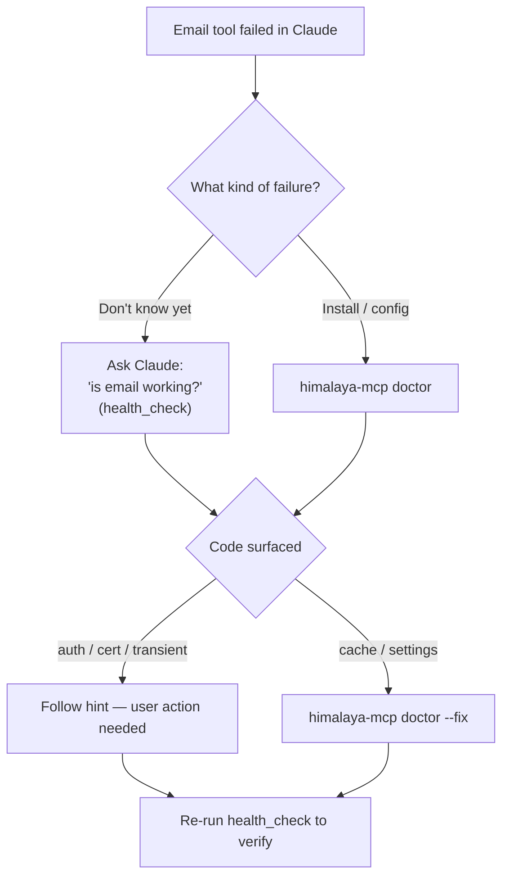

# Diagnose Email Issues

**Time:** 5 minutes | **Builds on:** [Multi-Account Email](../tutorials/multi-account.md)

When something stops working — auth fails, an account goes dark, a folder disappears — himalaya-mcp gives you two ways in: ask Claude (`health_check` tool), or run the CLI (`himalaya-mcp doctor`).

---

## Step 1: Ask Claude to run a health check

```
You: "Is email working?"
```

Claude calls the `health_check` tool. The response is structured JSON with one of three top-level states — `healthy`, `degraded`, or `broken` — plus per-account detail:

```json
{
  "overall": "degraded",
  "accounts": [
    { "name": "work", "reachable": true },
    {
      "name": "personal",
      "reachable": false,
      "code": "imap_auth_failed",
      "hint": "Re-check app password. Run: himalaya account configure <account>",
      "attempts": 1
    }
  ]
}
```

Claude reads the `code` and `hint` and tells you in plain English what to do.

## Step 2: Scope to one account

If `health_check` flagged one account, narrow the test:

```
You: "Check just my personal account"
```

Claude calls `health_check({ account: "personal" })` and returns one row. Useful when one account is slow and you don't want to wait on the others.

## Step 3: Run the CLI doctor for the full stack

`health_check` covers IMAP reachability. For a full-stack check (binary, config, MCP server, Desktop extension, plugin cache, environment, per-account IMAP), drop to a terminal:

```bash
himalaya-mcp doctor
```

Doctor groups checks by category and ends with a per-account `Accounts` section. Failures point you to `docs/guide/troubleshooting.md` with the matching error code.

## Step 4: Target one account from the CLI

```bash
himalaya-mcp doctor --account personal
```

Skips the account list discovery and probes a single account with a 5-second timeout. Good for `personal` being slow without holding up `work`.

## Step 5: Apply auto-fixes

```bash
himalaya-mcp doctor --fix
```

Only safe, deterministic fixes run automatically:

- Empty `himalaya_binary` in Desktop settings → set to `which himalaya`
- Missing Desktop extension settings file → create defaults
- Stale plugin cache at `~/.claude/plugins/cache/` → remove

Auth, cert, and network failures are never auto-fixed — they need user action.

## Step 6: Decode the error code

Both `health_check` and `doctor` surface the same stable codes:

| Code | What it means | Where to look |
|------|---------------|---------------|
| `imap_auth_failed` | App password expired or wrong | Re-run `himalaya account configure <name>` |
| `imap_cert_error` | TLS cert not trusted | Trust the cert or use `imap-encryption-tls.insecure` |
| `transient` | Network blip (retried once) | Check VPN / network |
| `folder_not_found` | UID or folder stale | Run `himalaya folder list` |
| `himalaya_not_installed` | Binary missing on PATH | `brew install himalaya` |

The full table lives in [Troubleshooting](../guide/troubleshooting.md).

## Decision flow



## What you learned

- `health_check` is the in-conversation diagnostic — Claude calls it for you
- `himalaya-mcp doctor` is the full-stack CLI version — broader than just IMAP
- Both share the same stable error codes (`imap_auth_failed`, `transient`, etc.)
- `--account <name>` scopes either tool to a single account
- `doctor --fix` only fixes deterministic things (caches, settings); auth/cert needs you

---

**Next:** [Triage Your Inbox](../tutorials/triage-inbox.md) | **Back to:** [Tutorials](../tutorials/index.md)
