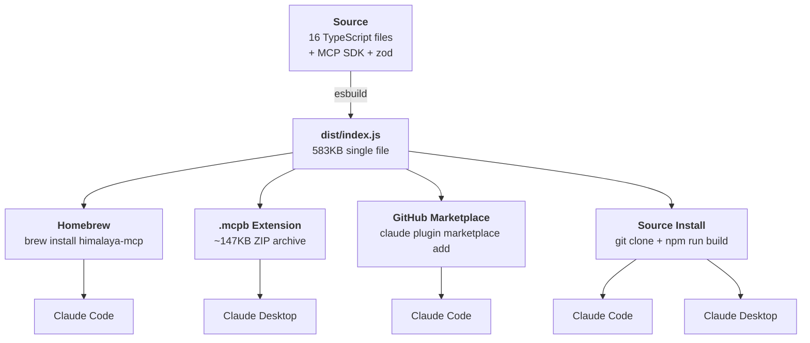

# Plugin Packaging & Distribution

himalaya-mcp is distributed via multiple channels targeting both Claude Code and Claude Desktop. This guide covers the packaging architecture, build process, and how each distribution method works.

## Distribution Channels

| Channel | Command | Target | Auto-setup |
|---------|---------|--------|------------|
| **Homebrew** (recommended) | `brew install data-wise/tap/himalaya-mcp` | Claude Code | Symlink, marketplace, auto-enable |
| **GitHub Marketplace** | `claude plugin marketplace add Data-Wise/himalaya-mcp` | Claude Code | Plugin cache |
| **.mcpb Extension** | Download from [Releases](https://github.com/Data-Wise/himalaya-mcp/releases) | Claude Desktop | One-click install, GUI settings |
| **Source** | `git clone` + `npm run build` | Both | Manual symlink |

### Distribution Architecture



## esbuild Bundle

The MCP server is bundled into a single file using esbuild, eliminating the 72MB `node_modules` directory.

### How it works

```bash
npm run build:bundle
# Equivalent to:
# esbuild src/index.ts --bundle --platform=node --target=node22 \
#   --outfile=dist/index.js --format=esm --minify
```

**Input:** 16 TypeScript source files + `@modelcontextprotocol/sdk` dependency

**Output:** Single `dist/index.js` (583KB minified)

The bundle includes all dependencies (MCP SDK, zod) inlined. No runtime `node_modules` needed -- just `node dist/index.js`.

### Why esbuild

- **72MB to 583KB** -- node_modules eliminated entirely
- **Zero runtime deps** -- single file ships in Homebrew formula
- **Fast** -- builds in ~25ms
- **ESM compatible** -- handles zod/v4 import maps and MCP SDK subpath exports

### Build scripts

| Script | Purpose | Output |
|--------|---------|--------|
| `npm run build` | TypeScript compilation (development) | `dist/*.js` + `.d.ts` + sourcemaps |
| `npm run build:bundle` | esbuild single-file (production) | `dist/index.js` (583KB) |

## Homebrew Formula

The formula lives in the [homebrew-tap](https://github.com/Data-Wise/homebrew-tap) repository at `Formula/himalaya-mcp.rb`.

### What `brew install` does

1. **Downloads** the release tarball from GitHub
2. **Installs dependencies** -- `himalaya` (email CLI) + `node` (runtime)
3. **Builds** -- runs `npm install` then `npm run build:bundle`
4. **Installs to libexec** -- `.claude-plugin/`, `.mcp.json`, `skills/`, `agents/`, `dist/`
5. **Runs post-install** -- auto-runs install script (symlink, marketplace registration, auto-enable)

### Post-install script

The `himalaya-mcp-install` script (created by the formula) auto-runs during `post_install`:

1. Detects if Claude Code is running (`pgrep -x "claude"`)
2. Symlinks `libexec` to `~/.claude/plugins/himalaya-mcp`
3. Registers in `~/.claude/local-marketplace/marketplace.json` (skipped if Claude is running)
4. Auto-enables in `~/.claude/settings.json` (skipped if Claude is running)
5. Uses stable `$(brew --prefix)/opt/himalaya-mcp/libexec` path (survives upgrades)

All JSON file writes (`marketplace.json`, `settings.json`) are guarded behind the Claude detection check because `mv` blocks indefinitely on files locked by Claude Code. If Claude is running during install, run `claude plugin install email@local-plugins` manually afterward.

### Uninstall

`brew uninstall himalaya-mcp` runs the `himalaya-mcp-uninstall` script which:

1. Removes the plugin symlink
2. Removes the marketplace.json entry
3. Removes the marketplace symlink

### Upgrade

`brew upgrade himalaya-mcp` preserves user configuration. The symlink always points to the stable opt path, so upgrades are seamless.

## Release Automation

When a GitHub release is published, the `homebrew-release.yml` workflow automatically updates the Homebrew formula.

### Pipeline

```
GitHub Release (v1.2.0)
  │
  ├─ validate         Build + test + bundle, verify package.json matches tag
  │
  ├─ prepare          Download tarball, compute SHA256 (5 retries, 10s delay)
  │
  └─ update-homebrew  Call reusable update-formula.yml → PR to homebrew-tap
```

### How it works

1. **Trigger** — publish a GitHub release (or manual `workflow_dispatch`)
2. **Validate** — checks out the tag, runs `npm ci`, verifies `package.json` version matches the release tag, then builds, tests, and bundles
3. **Prepare** — downloads the release tarball with retry logic (GitHub tarballs take seconds to materialize), computes SHA256
4. **Update** — calls the reusable `Data-Wise/homebrew-tap/.github/workflows/update-formula.yml` workflow, which opens a PR to update `Formula/himalaya-mcp.rb` with the new version and SHA

### Manual trigger

For re-running or testing without creating a new release:

```
gh workflow run homebrew-release.yml \
  -f version=1.2.0 \
  -f auto_merge=true
```

### Required secret

`HOMEBREW_TAP_GITHUB_TOKEN` — a fine-grained PAT with **Contents: Read and write** permission for `Data-Wise/homebrew-tap`. Set via:

```bash
gh secret set HOMEBREW_TAP_GITHUB_TOKEN --repo Data-Wise/himalaya-mcp
```

### Cross-repo authentication

The reusable workflow uses `persist-credentials: false` on `actions/checkout` and `unset GITHUB_TOKEN` before pushing. This prevents the GitHub Actions runner's credential helper from intercepting the push with the caller workflow's token (which only has access to himalaya-mcp, not homebrew-tap). Authentication is handled via the PAT embedded in the git remote URL.

## Marketplace Registration

The repository includes `.claude-plugin/marketplace.json` for GitHub-based plugin discovery:

```json
{
  "name": "himalaya-mcp-marketplace",
  "owner": { "name": "Data-Wise" },
  "plugins": [{
    "name": "email",
    "source": "./himalaya-mcp-plugin",
    "description": "Privacy-first email MCP server wrapping himalaya CLI",
    "category": "productivity",
    "tags": ["email", "mcp", "himalaya", "privacy"]
  }]
}
```

This enables the GitHub install flow:

```bash
claude plugin marketplace add Data-Wise/himalaya-mcp
claude plugin install email
```

## .mcpb Desktop Extension

The `.mcpb` format packages the MCP server as a Claude Desktop Extension -- a lightweight ZIP archive (~147 KB) containing the esbuild bundle and a `manifest.json` descriptor.

### Build

```bash
npm run build:mcpb
# Output: himalaya-mcp-v1.3.0.mcpb (147 KB)
```

This runs `scripts/build-mcpb.sh` which:

1. Builds the esbuild bundle (`dist/index.js`)
2. Copies the bundle to `mcpb/dist/`
3. Validates the manifest (`npx @anthropic-ai/mcpb validate mcpb/`)
4. Packs the archive (`npx @anthropic-ai/mcpb pack mcpb/`)
5. Renames to `himalaya-mcp-v{version}.mcpb`

### Install (GUI)

Download `himalaya-mcp-v{version}.mcpb` from [GitHub Releases](https://github.com/Data-Wise/himalaya-mcp/releases) and double-click to install in Claude Desktop.

### Install (CLI)

```bash
himalaya-mcp install-ext himalaya-mcp-v1.3.0.mcpb   # Install from file
himalaya-mcp install-ext                              # Auto-find in project root
himalaya-mcp remove-ext                               # Uninstall
```

The CLI install unpacks to `~/Library/Application Support/Claude/Claude Extensions/himalaya-mcp/`, registers in `extensions-installations.json`, and creates a default settings file. Restart Claude Desktop after install.

### User Configuration

During install (or via Settings > Extensions in Claude Desktop), users can configure:

| Setting | Type | Default | Description |
|---------|------|---------|-------------|
| Himalaya Binary | file | `himalaya` | Path to himalaya CLI binary |
| Default Account | string | (system default) | Email account from himalaya config |
| Default Folder | string | `INBOX` | Default folder for operations |

### What's in the .mcpb

| File | Size | Purpose |
|------|------|---------|
| `manifest.json` | 6.3 KB | Extension manifest (metadata, tools, prompts, config) |
| `dist/index.js` | 595 KB | esbuild bundle (all deps inlined) |

!!! note "See also"
    **[Desktop Extensions Reference](../reference/desktop-extensions.md)** for the full `.mcpb` format specification, manifest schema, and installation internals.

## Claude Desktop Setup CLI (Legacy)

The `himalaya-mcp` CLI provides a setup command for Claude Desktop users who prefer the legacy `mcpServers` approach:

```bash
himalaya-mcp setup           # Add MCP server to claude_desktop_config.json
himalaya-mcp setup --check   # Verify configuration exists and paths are valid
himalaya-mcp setup --remove  # Remove the server entry
```

**Config path:** `~/Library/Application Support/Claude/claude_desktop_config.json`

The setup command:

- Reads existing config (or creates a new one)
- Adds the `himalaya` MCP server entry
- Preserves all other existing servers
- Points to the plugin's `dist/index.js` via the standard plugin path

!!! tip "Prefer .mcpb for new installations"
    The `.mcpb` extension approach provides a GUI settings panel and automatic updates. Use `himalaya-mcp setup` only if you need manual control over the MCP server configuration.

## What Ships in Each Channel

| Content | Homebrew | GitHub | Source |
|---------|----------|--------|--------|
| `dist/index.js` (bundle) | Built during install | Pre-built | Built locally |
| `.claude-plugin/plugin.json` | Stripped to essentials | Full | Full |
| `.claude-plugin/marketplace.json` | In libexec | In repo | In repo |
| `.mcp.json` | In libexec | In repo | In repo |
| `skills/*.md` | At libexec root | In repo | In repo |
| `agents/*.md` | At libexec root | In repo | In repo |
| `node_modules/` | Not shipped | Not shipped | Local only |
| `src/` | Not shipped | In repo | In repo |
| `tests/` | Not shipped | In repo | In repo |

## Version Management

Versions are synchronized across three files:

| File | Field | Purpose |
|------|-------|---------|
| `package.json` | `version` | npm package version |
| `.claude-plugin/plugin.json` | `version` | Claude Code plugin version |
| `src/index.ts` | `VERSION` | MCP server reported version |

All three must match. The Homebrew formula URL references the GitHub release tag (e.g., `v1.1.0`). The `homebrew-release.yml` validate job enforces this — a mismatch between the release tag and `package.json` version will fail the workflow.
