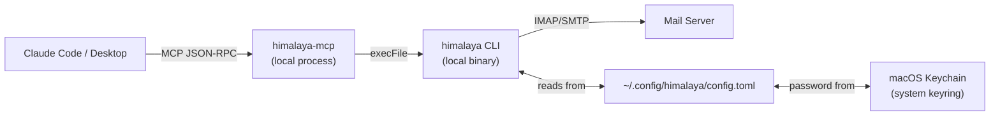

# Security & Privacy

## Overview

himalaya-mcp is designed around a simple principle: **your credentials never leave your machine.** All authentication stays local, and Claude interacts with your email through a local subprocess — not a cloud API.

## How Authentication Works



1. **himalaya CLI** stores credentials in `~/.config/himalaya/config.toml`
2. **Passwords** are stored in the system keychain (macOS Keychain, Linux Secret Service), not in the config file
3. **himalaya-mcp** never reads your config or passwords — it delegates all IMAP/SMTP communication to the himalaya binary via subprocess
4. **Claude** never sees raw IMAP credentials — the MCP server exposes only the email data

## Threat Model

### What himalaya-mcp protects against

| Threat | Mitigation |
|--------|-----------|
| Credential exfiltration | Credentials never enter the AI context — only the CLI binary touches them |
| Shell injection | All subprocess calls use `execFile` (not `exec` or `shell: true`), preventing argument injection |
| Prompt injection sending email | Two-phase safety gate requires explicit `confirm=true` — Claude cannot unilaterally send |
| Prompt injection deleting data | No delete operations exist — only flag and move |
| Man-in-the-middle on IMAP/SMTP | himalaya CLI enforces TLS by default; configurable via `--ssl` flags |

### What himalaya-mcp does NOT protect against

| Risk | Explanation |
|------|-------------|
| Compromised himalaya binary | If an attacker replaces the himalaya binary, they control email access. Verify via `brew doctor` or checksum check. |
| Malicious Claude session | A session with tool-use permission can read/list/search any accessible email. The session-confinement boundary is the MCP layer. |
| Keychain access | himalaya stores passwords in your system keyring, which protects them from other processes but not from a compromised account. |

## Credential Storage

himala stores passwords in the system keyring. The config file references the keyring entry rather than storing the password in plaintext.

```toml
# ~/.config/himalaya/config.toml (password stays in keychain)
[accounts.personal]
email = "you@personal.com"
imap_host = "imap.gmail.com"
imap_port = 993
smtp_host = "smtp.gmail.com"
smtp_port = 465
password_cmd = "security find-internet-password -s imap.gmail.com -w"
```

The `password_cmd` field runs the keyring lookup at connect time. himalaya-mcp never reads this field — it delegates to the himalaya binary.

## Safety Gates

Every destructive or sensitive operation requires explicit user confirmation:

| Tool | Without `confirm=true` | With `confirm=true` |
|------|----------------------|---------------------|
| `send_email` | Returns preview only | Sends the email |
| `compose_email` | Returns preview only | Sends the email |
| `delete_folder` | Returns warning | Deletes folder |
| `create_calendar_event` | Returns preview | Creates in Apple Calendar |

## The Plugin Hook

When installed as a Claude Code plugin, a `preToolUse` hook intercepts every `send_email` and `compose_email` call before it reaches the MCP server. The hook:

1. Logs the operation to `~/.himalaya-mcp/sent.log` (timestamp, to, subject)
2. Returns the preview to Claude to present for user approval
3. Blocks execution unless the user explicitly confirms

This provides an audit trail even if a session is compromised.

## Multi-Account Isolation

Each himalaya account is configured independently in `~/.config/himalaya/config.toml`. When using multiple accounts, the `account` parameter scopes all operations to that account's IMAP/SMTP session. One account's failure never leaks credentials or data from another.

## Security Best Practices

1. **Use app passwords** for Gmail/Outlook accounts (not your primary password)
2. **Run `himalaya-mcp doctor`** after installation to verify everything is configured correctly
3. **Keep himalaya updated** — `brew upgrade himalaya` for the latest security fixes
4. **Review the audit log** — check `~/.himalaya-mcp/sent.log` periodically
5. **Use separate accounts** for work and personal email (multi-account support keeps them isolated)

## Related

- [Architecture](../reference/architecture.md) — system design and data flow
- [User Guide](../guide/guide.md) — complete walkthrough
- [Troubleshooting](troubleshooting.md) — common failure modes
