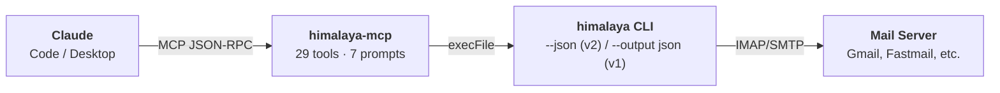

# himalaya-mcp

**Privacy-first email for Claude** -- an MCP server and Claude Code plugin (`himalaya`) wrapping the [himalaya](https://github.com/pimalaya/himalaya) CLI.

---

## What is himalaya-mcp?

himalaya-mcp gives Claude the ability to read, triage, compose, and manage email -- all without sending your credentials to the cloud. It wraps the local himalaya CLI as a subprocess, exposing email operations through the [Model Context Protocol](https://modelcontextprotocol.io/). Install as the **`himalaya`** plugin in Claude Code for `/himalaya:*` slash commands.

## Key Features

<div class="grid cards" markdown>

- :envelope: **29 MCP Tools**

    ---

    List, search, read, flag, move, draft reply, send, export, action items, clipboard, folders, attachments, calendar, threads

    [:octicons-arrow-right-24: MCP Tools](reference/commands.md)

- :brain: **7 MCP Prompts**

    ---

    Triage inbox, summarize email, daily digest, weekly digest, draft reply, morning briefing, inbox check

    [:octicons-arrow-right-24: Prompts](reference/commands.md#prompts)

- :lock: **Two-Phase Send**

    ---

    `send_email` returns a preview first; requires explicit `confirm=true`

    [:octicons-arrow-right-24: Safety Model](guide/guide.md#safety-model)

- :people_holding_hands: **Multi-Account**

    ---

    Switch accounts per-call via `account` parameter

    [:octicons-arrow-right-24: Multi-Account Guide](guide/workflows.md#6-multi-account-workflow)

- :electric_plug: **Plugin + Server + Extension**

    ---

    Claude Code plugin (16 skills, 2 hooks), MCP server, or `.mcpb` Desktop Extension

    [:octicons-arrow-right-24: Installation](getting-started/installation.md)

- :shield: **Privacy-First**

    ---

    All authentication stays local. No OAuth tokens leave your machine.

    [:octicons-arrow-right-24: Architecture](reference/architecture.md)

</div>

## How It Works


```mermaid
flowchart LR
    A["`**Claude**
    Code / Desktop`"] -->|MCP JSON-RPC| B["`**himalaya-mcp**
    29 tools · 7 prompts`"]
    B -->|execFile| C["`**himalaya CLI**
    --json (v2) / --output json (v1)`"]
    C -->|IMAP/SMTP| D["`**Mail Server**
    Gmail, Fastmail, etc.`"]
```

- All authentication stays local (himalaya handles IMAP/SMTP auth)
- No OAuth tokens leave your machine
- Subprocess uses `execFile` (no shell injection)
- Claude never sends email without your explicit confirmation

## Plugin Skills

When installed as a Claude Code plugin, these slash commands are available:

| Skill | Description |
|-------|-------------|
| `/himalaya:inbox` | Check inbox, list recent emails |
| `/himalaya:triage` | AI-powered email classification |
| `/himalaya:digest` | Generate daily priority digest |
| `/himalaya:reply` | Draft and send with safety gate |
| `/himalaya:compose` | Compose new emails with safety gate |
| `/himalaya:respond` | Read, understand, and reply to emails |
| `/himalaya:morning` | Morning briefing with urgency classification |
| `/himalaya:attachments` | List, download, and calendar invites |
| `/himalaya:forward` | Forward email with context and attribution |
| `/himalaya:export` | Export to markdown with YAML frontmatter |
| `/himalaya:threads` | View and navigate conversation threads |
| `/himalaya:search` | Search by keyword, sender, flags, dates |
| `/himalaya:manage` | Bulk flag, move, archive with confirmation |
| `/himalaya:stats` | Inbox statistics, top senders, trends |
| `/himalaya:config` | Setup wizard with provider templates |
| `/himalaya:help` | Help hub -- browse all tools, prompts, workflows |

## Quick Start

### Homebrew (recommended)

```bash
brew tap data-wise/tap
brew install himalaya-mcp
```

That's it. Homebrew installs himalaya CLI + Node.js, bundles the server, symlinks the plugin, and auto-enables it in Claude Code.

### Claude Code Plugin (from GitHub)

Prerequisites: `brew install node himalaya` (not bundled with GitHub install).

```bash
claude plugin marketplace add Data-Wise/himalaya-mcp
claude plugin install himalaya
```

### From Source

```bash
brew install himalaya          # Email CLI
git clone https://github.com/Data-Wise/himalaya-mcp.git
cd himalaya-mcp
npm install && npm run build
ln -s $(pwd) ~/.claude/plugins/himalaya-mcp
```

### Claude Desktop

```bash
# Desktop Extension (.mcpb) — recommended
# Download .mcpb from GitHub Releases, double-click to install
# Or via CLI:
himalaya-mcp install-ext

# Legacy MCP server config
himalaya-mcp setup
```

### Verify Installation

```bash
himalaya-mcp doctor            # Check all settings across the stack
himalaya-mcp doctor --fix      # Auto-fix common issues
```

Then in Claude Code:

```
You: "Check my inbox"
You: "Triage my last 10 emails"
You: "Reply to the meeting email"
You: "Give me today's email digest"
You: "/himalaya:help"
```

## Next Steps

- **[Installation](getting-started/installation.md)** -- detailed setup guide
- **[Quick Start](getting-started/quickstart.md)** -- first email in 2 minutes
- **[Tutorials](tutorials/index.md)** -- step-by-step from beginner to automation
- **[Cheat Sheet](reference/cheat-sheet.md)** -- one-page quick reference
- **[MCP Tools](reference/commands.md)** -- all 29 tools, 7 prompts, 3 resources
- **[CLI Reference](reference/cli.md)** -- `doctor`, `setup`, `install-ext`, `remove-ext`
- **[User Guide](guide/guide.md)** -- complete walkthrough
- **[Workflows](guide/workflows.md)** -- common email patterns
- **[Cookbook](guide/cookbook.md)** -- practical recipes combining multiple skills
- **[Architecture](reference/architecture.md)** -- system design and security
- **[Desktop Extension](getting-started/desktop-extension.md)** -- install `.mcpb` in Claude Desktop
- **[Desktop Extensions Reference](reference/desktop-extensions.md)** -- `.mcpb` format details
