# himalaya-mcp

**Privacy-first email MCP server and Claude Code plugin wrapping the [himalaya](https://github.com/pimalaya/himalaya) CLI.**

---

## What is himalaya-mcp?

himalaya-mcp gives Claude the ability to read, triage, compose, and manage email -- all without sending your credentials to the cloud. It wraps the local himalaya CLI as a subprocess, exposing email operations through the [Model Context Protocol](https://modelcontextprotocol.io/).

## Key Features

<div class="grid cards" markdown>

- :envelope: **11 MCP Tools**

    ---

    List, search, read, flag, move, draft reply, send, export, action items, clipboard

- :brain: **4 MCP Prompts**

    ---

    Triage inbox, summarize email, daily digest, draft reply

- :lock: **Two-Phase Send**

    ---

    `send_email` returns a preview first; requires explicit `confirm=true`

- :people_holding_hands: **Multi-Account**

    ---

    Switch accounts per-call via `--account` parameter

- :electric_plug: **Plugin + Server**

    ---

    Use as a Claude Code plugin or standalone MCP server

- :shield: **Privacy-First**

    ---

    All authentication stays local. No OAuth tokens leave your machine.

</div>

## How It Works

```mermaid
flowchart LR
    A["`**Claude**
    Code / Desktop`"] -->|MCP JSON-RPC| B["`**himalaya-mcp**
    11 tools · 4 prompts`"]
    B -->|execFile| C["`**himalaya CLI**
    --output json`"]
    C -->|IMAP/SMTP| D["`**Mail Server**
    Gmail, Fastmail, etc.`"]
```



- All authentication stays local (himalaya handles IMAP/SMTP auth)
- No OAuth tokens leave your machine
- Subprocess uses `execFile` (no shell injection)
- Claude never sends email without your explicit confirmation

## Quick Start

```bash
# Prerequisites
brew install himalaya          # Email CLI
node --version                 # Node.js 22+

# Install
git clone https://github.com/Data-Wise/himalaya-mcp.git
cd himalaya-mcp
npm install && npm run build

# Use as Claude Code plugin
ln -s $(pwd) ~/.claude/plugins/himalaya-mcp
```

Then in Claude Code:

```
You: "Check my inbox"
You: "Triage my last 10 emails"
You: "Reply to the meeting email"
You: "Give me today's email digest"
```

## Next Steps

- **[Installation](getting-started/installation.md)** -- detailed setup guide
- **[Quick Start](getting-started/quickstart.md)** -- first email in 2 minutes
- **[User Guide](guide/guide.md)** -- complete tool and prompt reference
- **[Workflows](guide/workflows.md)** -- common email patterns
- **[Quick Reference](reference/refcard.md)** -- one-page cheat sheet
