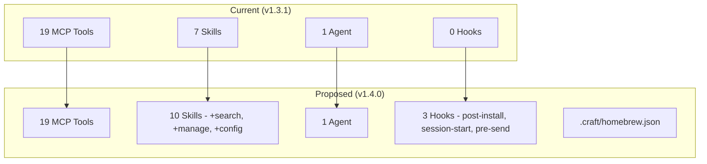

# SPEC: himalaya-mcp Enhancement Gaps

**Status:** draft
**Created:** 2026-02-25
**From Brainstorm:** This session (deep feat save)
**Version:** himalaya-mcp v1.3.1

## Overview

Addresses gaps identified after the v1.3.1 installation docs overhaul and Homebrew formula generator integration. Focuses on missing skills, empty hooks, installation friction, and release automation.

## Primary User Story

As a **Claude Code user with himalaya configured**, I want email skills to be discoverable and complete so I can manage my inbox without knowing raw MCP tool names.

## Acceptance Criteria

- [ ] All 19 MCP tools have corresponding skill coverage (currently 7 skills cover ~14 tools)
- [ ] Hooks directory has at least post-install and pre-send hooks
- [ ] `himalaya-mcp doctor` runs automatically after installation
- [ ] `/craft:dist:homebrew` recognizes himalaya-mcp via `.craft/homebrew.json`

## Secondary User Stories

- As a **new user**, I want guided himalaya configuration so I don't need to manually create config.toml
- As a **power user**, I want inbox analytics and bulk operations without chaining raw tool calls
- As a **maintainer**, I want release automation so version bumps and changelogs aren't manual

## Enhancement Inventory

### Tier 1 — Quick Wins (< 30 min each)

| # | Enhancement | Type | Effort | Priority |
|---|-------------|------|--------|----------|
| 1 | `/email:search` skill | skill | 20 min | High |
| 2 | `/email:manage` skill (bulk flag/move) | skill | 30 min | High |
| 3 | `.craft/homebrew.json` config | config | 10 min | Medium |
| 4 | Post-install hook (`doctor`) | hook | 20 min | High |

### Tier 2 — Medium Effort (1-2 hours each)

| # | Enhancement | Type | Effort | Priority |
|---|-------------|------|--------|----------|
| 5 | `/email:config` setup wizard | skill | 2 hr | High |
| 6 | `/email:stats` inbox analytics | skill | 1 hr | Medium |
| 7 | Session-start hook (unread notification) | hook | 1 hr | Medium |
| 8 | Pre-send confirmation gate hook | hook | 1 hr | High |

### Tier 3 — Long-term (4+ hours)

| # | Enhancement | Type | Effort | Priority |
|---|-------------|------|--------|----------|
| 9 | Release automation (bump + changelog) | scripts | 4 hr | Medium |
| 10 | Zero-config install (detect macOS accounts) | feature | 8 hr | Low |
| 11 | Multi-account skill enhancements | skill | 4 hr | Low |

## Architecture



## API Design

N/A — No API changes. All enhancements are plugin-layer skills, hooks, and config.

## Data Models

N/A — No data model changes. Skills use existing MCP tools.

## Dependencies

| Dependency | Required By | Status |
|------------|-------------|--------|
| himalaya CLI | All skills | Already required |
| Node.js | MCP server | Already required |
| craft plugin | `.craft/homebrew.json` | Optional (craft integration) |

## UI/UX Specifications

### Skill Discovery Flow

```
User: /email:help
→ Shows all 10 skills (currently 7)
→ New skills appear in correct categories:
   Search & Filter: /email:search (NEW)
   Management: /email:manage (NEW)
   Setup: /email:config (NEW)
   Analytics: /email:stats (NEW)
```

### Post-Install Hook UX

```
$ brew install data-wise/tap/himalaya-mcp
...
==> Running post-install hook...
✓ himalaya binary found (v1.1.0)
✓ himalaya account configured (1 account)
✓ MCP server responds
✓ Plugin registered in Claude Code
```

### Pre-Send Confirmation Gate

```
Claude: I'll send this email now.
[Hook intercepts]
━━━━━━━━━━━━━━━━━━━━━━━━━━━━━━
📧 SEND CONFIRMATION
  To: boss@company.com
  Subject: Q1 Report
  Body: (preview first 3 lines)
━━━━━━━━━━━━━━━━━━━━━━━━━━━━━━
Type "send" to confirm, anything else to cancel.
```

N/A — Accessibility: CLI-only, no visual UI.

## Open Questions

- Should `/email:config` support OAuth2 flows (Gmail requires it) or just app passwords?
- Session-start hook: acceptable latency budget? (5s proposed)
- Multi-account: should skills default to "all accounts" or require explicit `--account`?

## Review Checklist

- [ ] All new skills follow existing skill template format
- [ ] Hooks use Claude Code hook API correctly
- [ ] `.craft/homebrew.json` matches craft schema
- [ ] `/email:help` updated with new skills
- [ ] Tests added for new skills
- [ ] CHANGELOG updated
- [ ] Version bumped (v1.4.0)

## Implementation Notes

- **Skill files are pure markdown** — no code changes needed for Tier 1 items
- **Hooks require Claude Code hook format** — check `.claude/hooks` schema before implementing
- **`/email:config` is the highest-impact item** — solves the #1 support issue (himalaya not configured)
- **Pre-send hook is defense-in-depth** — agent already has safety rules, hook adds a second layer
- **Recommended implementation order:** #1 → #2 → #4 → #3 → #8 → #5 → #6 → #7 → #9

## History

| Date | Change |
|------|--------|
| 2026-02-25 | Initial spec from deep brainstorm session |
