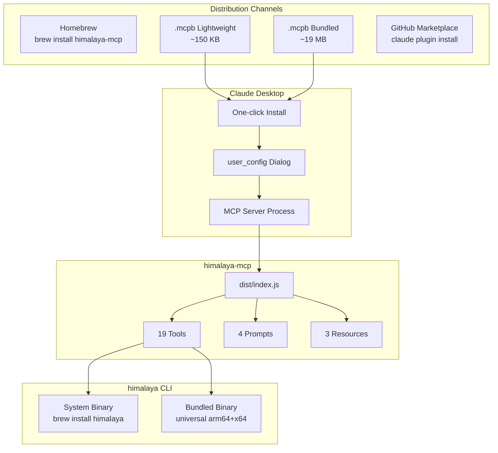

# SPEC: .mcpb Packaging for Claude Desktop

**Status:** draft
**Created:** 2026-02-17
**From Brainstorm:** BRAINSTORM-mcpb-packaging-2026-02-17.md
**Version:** 1.0

---

## Overview

Package himalaya-mcp as a `.mcpb` Desktop Extension for Claude Desktop, enabling one-click installation. Ship a lightweight variant first (~150 KB, requires `brew install himalaya`), with an optional bundled variant later (~19 MB, includes universal himalaya binary).

## Primary User Story

**As a** Claude Desktop user who wants email access,
**I want to** install himalaya-mcp with one click from a `.mcpb` file,
**So that** I don't have to manually edit `claude_desktop_config.json`.

### Acceptance Criteria

- [ ] `.mcpb` file installs successfully in Claude Desktop
- [ ] Install dialog shows optional config fields (binary path, account, folder)
- [ ] MCP server starts and all 19 tools are available
- [ ] Existing `himalaya-mcp setup` CLI continues to work as fallback

## Secondary User Stories

**As a** developer distributing himalaya-mcp,
**I want** an automated build pipeline for `.mcpb` packaging,
**So that** releases include the Desktop Extension automatically.

**As a** power user without Homebrew,
**I want** a bundled `.mcpb` with the himalaya binary included,
**So that** I have a fully self-contained installation.

## Architecture



## API Design

N/A - No API changes. The `.mcpb` packaging wraps the existing MCP server without modifications.

## Data Models

N/A - No data model changes. The manifest.json is a new configuration file, not a data model.

### manifest.json Schema

```json
{
  "manifest_version": "0.3",
  "name": "himalaya-mcp",
  "display_name": "Himalaya Email",
  "version": "1.2.0",
  "description": "Privacy-first email for Claude via the himalaya CLI",
  "author": { "name": "Data-Wise", "url": "https://github.com/Data-Wise" },
  "license": "MIT",
  "server": {
    "type": "node",
    "entry_point": "dist/index.js",
    "mcp_config": {
      "command": "node",
      "args": ["${__dirname}/dist/index.js"],
      "env": {
        "HIMALAYA_BINARY": "${user_config.himalaya_binary}",
        "HIMALAYA_ACCOUNT": "${user_config.himalaya_account}",
        "HIMALAYA_FOLDER": "${user_config.himalaya_folder}"
      }
    }
  },
  "user_config": {
    "himalaya_binary": { "type": "file", "title": "Himalaya Binary", "required": false },
    "himalaya_account": { "type": "string", "title": "Default Account", "required": false },
    "himalaya_folder": { "type": "string", "title": "Default Folder", "default": "INBOX", "required": false }
  },
  "compatibility": {
    "platforms": ["darwin"],
    "runtimes": { "node": ">=22.0.0" }
  }
}
```

## Dependencies

| Dependency | Purpose | Required? |
|-----------|---------|-----------|
| `@anthropic-ai/mcpb` | CLI for init/validate/pack/sign | Dev only |
| himalaya CLI | Email operations | Runtime (user installs separately or bundled) |
| Node.js 22+ | MCP server runtime | Runtime (system install) |
| esbuild | Bundle dist/index.js | Dev only (existing) |

## UI/UX Specifications

### Install Flow

1. User downloads `himalaya-mcp-v1.2.0.mcpb` from GitHub Releases
2. Double-clicks or drags to Claude Desktop
3. Install dialog appears with optional config fields:
   - Himalaya Binary (file picker, optional)
   - Default Account (text field, optional)
   - Default Folder (text field, default "INBOX")
4. User clicks "Install"
5. Extension appears in Claude Desktop, MCP server starts
6. User says "check my inbox" and Claude calls list_emails

### User Flow Diagram

```
Download .mcpb → Open in Claude Desktop → Config Dialog → Install → Use
```

### Accessibility

N/A - Claude Desktop handles the install UI; we provide metadata only.

## Open Questions

1. **Empty user_config values**: Does an empty file picker pass `""` or omit the env var? Need to test — our config.ts should handle both.
2. **tools_generated flag**: Can we use `tools_generated: true` instead of listing all 19 tools? Would reduce manifest size and avoid sync issues.
3. **Official directory**: What's the submission process? Would enable auto-updates.
4. **Built-in Node.js**: Does Claude Desktop provide a Node.js runtime, or must the system have one?

## Review Checklist

- [ ] manifest.json validates with `mcpb validate`
- [ ] `.mcpb` installs in Claude Desktop without errors
- [ ] user_config fields appear correctly in install dialog
- [ ] Empty optional fields don't break the MCP server
- [ ] All 19 tools work after .mcpb installation
- [ ] Build script produces reproducible .mcpb files
- [ ] CI validates .mcpb as part of release pipeline
- [ ] Documentation updated (installation guide, architecture)

## Implementation Notes

### Phase 1: Lightweight .mcpb (This Spec)

1. Create `mcpb/` directory with manifest.json
2. Build script: `npm run build:bundle` then `mcpb pack mcpb/ himalaya-mcp-v{version}.mcpb`
3. Add .mcpb to GitHub Releases as artifact
4. Update installation docs with .mcpb option
5. Test on clean Claude Desktop install

### Phase 2: Bundled Variant (Future)

1. Download arm64 + x64 himalaya binaries from GitHub releases
2. Create universal binary with `lipo -create`
3. Include in `mcpb-bundled/bin/himalaya`
4. Set `HIMALAYA_BINARY=${__dirname}/bin/himalaya` in manifest
5. Document Gatekeeper approval (System Settings > Privacy & Security)
6. Separate download on GitHub Releases

### Phase 3: Signed + Official (Future)

1. Apple Developer certificate ($99/yr)
2. Sign universal binary + notarize
3. Submit to Anthropic's extension directory
4. Auto-updates for installed users

### Branch Strategy

- Work on `feature/mcpb-packaging` branch (worktree from dev)
- Standalone effort, no dependencies on other features
- PR to dev when Phase 1 complete

## History

| Date | Change |
|------|--------|
| 2026-02-17 | Initial spec from max-depth brainstorm with 2 agents |
