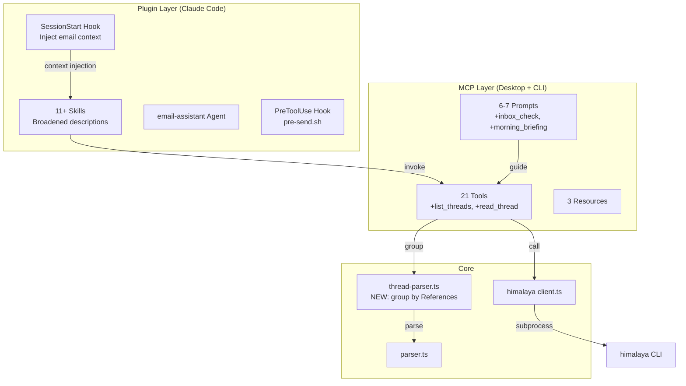

# SPEC: Plugin Improvements v1.5.0

**Status:** draft
**Created:** 2026-03-17
**From Brainstorm:** [BRAINSTORM-plugin-improvements-2026-03-17.md](./BRAINSTORM-plugin-improvements-2026-03-17.md)

---

## Overview

Make himalaya-mcp's Claude Code plugin and Desktop extension work naturally without requiring explicit `/email:*` slash commands. Add thread/conversation view as the primary new capability. Improve Desktop parity with additional MCP prompts. Fix auto-enable after Homebrew install.

**Theme:** "Make it work without slash commands"

---

## Primary User Story

**As a** power user who says "check my email" to Claude,
**I want** the email plugin to activate automatically and show my inbox,
**so that** I don't have to remember slash commands or tool names.

### Acceptance Criteria

- [ ] Saying "check my email" in a fresh session triggers inbox listing without `/email:inbox`
- [ ] Saying "triage my inbox" triggers triage workflow without `/email:triage`
- [ ] Thread view groups related emails by conversation
- [ ] Morning briefing summarizes inbox with urgency classification
- [ ] Desktop users have prompts that mirror CLI skill workflows
- [ ] `brew install himalaya-mcp` results in an auto-enabled plugin (no manual steps)
- [ ] All existing tests pass + new tests for added features
- [ ] Test count increases by 40-60 (from 342 to ~382-402)

---

## Secondary User Stories

**As a** Desktop extension user,
**I want** MCP prompts that guide Claude through email workflows,
**so that** I get the same experience as CLI plugin users.

**As a** user who follows email threads,
**I want** to see all messages in a conversation grouped together,
**so that** I have full context when reading or replying.

---

## Architecture



### New Files

| File | Purpose |
|------|---------|
| `src/himalaya/thread-parser.ts` | Group envelopes into threads by References/In-Reply-To/subject |
| `src/tools/threads.ts` | `list_threads` + `read_thread` MCP tools |
| `src/prompts/morning.ts` | `morning_briefing` MCP prompt |
| `src/prompts/inbox-check.ts` | `inbox_check` MCP prompt |
| `tests/threads.test.ts` | Thread grouping + tool tests |
| `tests/morning.test.ts` | Morning briefing prompt tests |

### Modified Files

| File | Change |
|------|--------|
| `himalaya-mcp-plugin/hooks/` | Add SessionStart hook config |
| `himalaya-mcp-plugin/.claude-plugin/plugin.json` | Add SessionStart hook entry |
| `himalaya-mcp-plugin/skills/*/SKILL.md` (all 11) | Broaden descriptions with natural language variants |
| `src/index.ts` | Register new tools + prompts, bump VERSION |
| `src/himalaya/types.ts` | Add Thread type, extend Envelope with references field |
| `mcpb/manifest.json` | Add new tools + prompts to manifest |
| `src/prompts/digest.ts` | Enhance with urgency classification |
| `scripts/build-mcpb.sh` | No changes needed (auto-includes new src/) |

---

## API Design

### New MCP Tools

| Tool | Parameters | Returns |
|------|-----------|---------|
| `list_threads` | `folder?`, `account?`, `page_size?`, `page?` | Array of Thread objects (subject, participants, count, latest_date, message_ids) |
| `read_thread` | `thread_id` (first message ID), `account?` | Array of messages in chronological order with sender, date, body |

### Thread Object Schema

```typescript
interface Thread {
  thread_id: string;        // ID of first message in thread
  subject: string;          // Normalized subject (stripped Re:/Fwd:)
  participants: string[];   // All unique senders
  message_count: number;
  latest_date: string;      // ISO 8601
  messages: {
    id: string;
    from: string;
    date: string;
    snippet: string;        // First 100 chars of body
  }[];
}
```

### New MCP Prompts

| Prompt | Arguments | Purpose |
|--------|-----------|---------|
| `inbox_check` | `account?`, `folder?` | Guide Claude through inbox listing + summary (Desktop equivalent of /email:inbox) |
| `morning_briefing` | `account?` | Full morning workflow: unread count, urgency classification, top 5 summaries, calendar events, action items |

---

## Data Models

### Envelope Extension

```typescript
// Extend existing Envelope type in src/himalaya/types.ts
interface Envelope {
  // ... existing fields ...
  references?: string[];    // Message-IDs this email references
  in_reply_to?: string;     // Message-ID this email replies to
}
```

### Thread Grouping Algorithm

```
1. Fetch envelopes with --output json
2. For each envelope, extract References + In-Reply-To headers
3. Build adjacency map: message_id -> parent_id
4. Group into connected components (threads)
5. Fallback: if no References header, group by normalized subject
6. Sort threads by latest_date descending
```

---

## Dependencies

| Dependency | Purpose | Status |
|------------|---------|--------|
| himalaya CLI v1.2.0+ | Subprocess backend | Already installed |
| @modelcontextprotocol/sdk | MCP protocol | Already bundled |
| Node.js 22+ | Runtime | Already required |
| None new | No new dependencies needed | - |

---

## UI/UX Specifications

N/A - CLI plugin only. No visual UI components.

### User Flow: Natural Language Activation

```
User: "Check my email"
  ↓ SessionStart hook already injected email context
  ↓ Claude matches intent to /email:inbox skill
  ↓ Skill executes: list_emails → format → present
User sees: Inbox listing with unread count

User: "Show me the thread about the deployment"
  ↓ Claude uses search_emails to find matching emails
  ↓ Claude uses read_thread to get full conversation
User sees: All messages in thread, chronological order
```

### User Flow: Morning Briefing

```
User: "Morning briefing" or "What happened overnight"
  ↓ Claude matches to /email:morning skill (or morning_briefing prompt on Desktop)
  ↓ list_emails (unread, last 24h)
  ↓ Classify by urgency
  ↓ Summarize top 5
  ↓ Extract calendar events
  ↓ List action items
User sees: Structured briefing with urgency levels

User: "Reply to the urgent ones"
  ↓ Claude identifies urgent emails from briefing
  ↓ For each: draft_reply → preview → confirm → send_email
User sees: Sequential reply workflow with safety gates
```

---

## Implementation Increments

### Increment 1: SessionStart Hook + Skill Descriptions (1 hr)

- Add SessionStart hook to plugin.json
- Create hook script/config
- Broaden all 11 skill descriptions
- Test: verify hook fires, verify natural language triggers

### Increment 2: Thread View (4 hr)

- Add thread-parser.ts with grouping algorithm
- Add threads.ts tools (list_threads, read_thread)
- Extend Envelope type with references field
- Parse References/In-Reply-To from himalaya output
- Tests: thread grouping, edge cases, tool registration

### Increment 3: Morning Briefing + Desktop Prompts (2 hr)

- Enhance digest skill with urgency classification
- Add morning_briefing MCP prompt
- Add inbox_check MCP prompt
- Create /email:morning skill
- Tests: prompt registration, output format

### Increment 4: Auto-Enable Fix + Polish (1 hr)

- Patch Homebrew post_install for settings.json
- Update mcpb/manifest.json with new tools/prompts
- Update docs (guide.md, REFCARD.md, CHANGELOG.md)
- Update test counts in .STATUS and CLAUDE.md

---

## Open Questions

1. **himalaya References header** — Does `himalaya envelope list --output json` include References/In-Reply-To? If not, need `himalaya message read --raw` per email (expensive). Must investigate before implementing Increment 2.

2. **SessionStart latency** — Command-type hook (static JSON) adds ~10ms. Prompt-type (LLM evaluation) adds ~500ms+. Start with command, consider prompt later.

3. **Thread grouping performance** — For 100+ email inboxes, grouping may be slow. Consider caching or limiting to last N days.

4. **himalaya subject threading** — Subject-based fallback ("Re: X" → "X") is fuzzy. Acceptable for v1.5.0 or need strict References-only?

---

## Review Checklist

- [ ] All acceptance criteria met
- [ ] No breaking changes to existing tools/skills
- [ ] Thread parser handles edge cases (no references, missing headers, circular refs)
- [ ] Safety gates preserved for all send/compose operations
- [ ] Desktop prompts tested in Claude Desktop
- [ ] SessionStart hook doesn't add perceptible latency
- [ ] Auto-enable tested on clean macOS install
- [ ] Documentation updated (guide, refcard, changelog, CLAUDE.md)
- [ ] Test count verified (target: 382-402)
- [ ] Bundle size still under 1 MB after new tools

---

## Implementation Notes

- **Thread parser should be pure** — no himalaya calls, just grouping logic on Envelope arrays. This makes it testable with mock data.
- **SessionStart hook must be fast** — use `command` type with static JSON, not `prompt` type. Can upgrade to smart detection in v1.6.0.
- **Skill description changes are low-risk** — only modifying description text, no behavioral changes. Can be done on dev directly as docs-level change.
- **Desktop prompts are additive** — new files in src/prompts/, registered in index.ts. No changes to existing prompts.
- **Auto-enable patch is fragile** — depends on settings.json format not changing. Add error handling and fallback to manual instructions.

---

## History

| Date | Change |
|------|--------|
| 2026-03-17 | Initial spec from max-depth brainstorm session |

---

**Last Updated:** 2026-03-17
