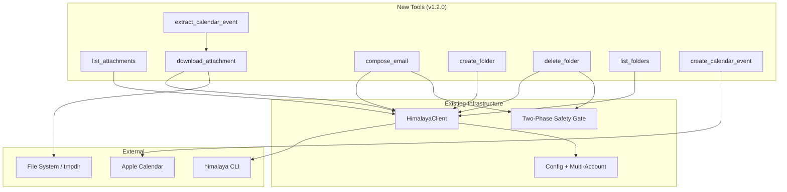

# SPEC: himalaya-mcp v1.2.0 Features

**Status:** draft
**Created:** 2026-02-15
**From Brainstorm:** BRAINSTORM-v1.2.0-features-2026-02-15.md
**Version:** v1.2.0

---

## Overview

Expand himalaya-mcp from 11 to 19 MCP tools by adding four feature areas: attachment support, email composition (new messages), folder management, and calendar integration. Each feature wraps existing himalaya CLI commands where available, with custom code only for calendar ICS parsing and Apple Calendar integration.

---

## Primary User Story

**As a** Claude Code user managing email through himalaya-mcp,
**I want to** download attachments, compose new emails, manage folders, and create calendar events from meeting invites,
**So that** I can handle my complete email workflow without leaving Claude.

### Acceptance Criteria

- [ ] All 8 new tools register and appear in MCP tool listing
- [ ] Attachment download saves to temp directory and returns file path
- [ ] Compose email uses the same two-phase safety gate as send_email
- [ ] Folder create/delete/list wrap himalaya CLI commands directly
- [ ] Calendar event extraction parses ICS from downloaded attachments
- [ ] Calendar event creation uses AppleScript (macOS only, mocked in tests)
- [ ] All new tools support multi-account via `account` parameter
- [ ] ~36 new tests pass, bringing total from 181 to ~217

---

## Secondary User Stories

### Attachment Workflow
**As a** user receiving documents via email,
**I want to** list and download attachments,
**So that** Claude can process files (PDFs, spreadsheets, etc.) from my inbox.

### Fresh Email Composition
**As a** user who needs to send new emails (not replies),
**I want to** compose and send fresh messages with subject, recipients, and body,
**So that** I'm not limited to only replying to existing threads.

### Folder Organization
**As a** user with multiple email folders/labels,
**I want to** create, delete, and list folders,
**So that** Claude can help organize my email structure.

### Calendar Integration
**As a** user receiving meeting invites via email,
**I want to** extract event details and create Apple Calendar entries,
**So that** meeting invites flow from email to my calendar automatically.

---

## Architecture



### Build Order

```
Phase 6a: Folders (independent, simplest, 3 tools)
Phase 6b: Compose (independent, mirrors existing pattern, 1 tool)
Phase 6c: Attachments (independent, 2 tools, but Calendar depends on it)
Phase 6d: Calendar (depends on Attachments for ICS download, 2 tools)
```

---

## API Design

### New Tools

| Tool | Parameters | Returns | Safety Gate |
|------|-----------|---------|-------------|
| `list_attachments` | `id`, `folder?`, `account?` | `[{filename, mime, size}]` | No |
| `download_attachment` | `id`, `filename`, `folder?`, `account?` | `{path, size, mime}` | No |
| `compose_email` | `to`, `subject`, `body`, `cc?`, `bcc?`, `confirm?`, `account?` | Preview or send result | Yes (two-phase) |
| `create_folder` | `name`, `account?` | `{success, name}` | No |
| `delete_folder` | `name`, `confirm?`, `account?` | Preview or delete result | Yes (two-phase) |
| `list_folders` | `account?` | `[{name, desc?}]` | No |
| `extract_calendar_event` | `id`, `folder?`, `account?` | `{summary, dtstart, dtend, location?, organizer?, description?}` | No |
| `create_calendar_event` | `event` (CalendarEvent), `confirm?` | Preview or creation result | Yes (two-phase) |

### CLI Command Mapping

| Tool | himalaya Command |
|------|-----------------|
| `list_attachments` | `himalaya attachment list --output json <id>` |
| `download_attachment` | `himalaya attachment download <id> <filename>` |
| `compose_email` | `himalaya template write` + `himalaya template send` |
| `create_folder` | `himalaya folder create <name>` |
| `delete_folder` | `himalaya folder delete <name>` |
| `list_folders` | `himalaya folder list --output json` |
| `extract_calendar_event` | Download .ics attachment, parse ICS content |
| `create_calendar_event` | AppleScript via osascript subprocess |

---

## Data Models

### New TypeScript Types

```typescript
// Attachment metadata from himalaya CLI
interface Attachment {
  filename: string;
  mime: string;
  size: number;        // bytes
}

// Folder metadata
interface Folder {
  name: string;
  desc?: string;       // optional description/path
}

// Parsed calendar event from ICS
interface CalendarEvent {
  summary: string;     // event title
  dtstart: string;     // ISO datetime
  dtend: string;       // ISO datetime
  location?: string;
  organizer?: string;
  description?: string;
  uid?: string;        // unique event ID from ICS
}
```

### New Client Methods

| Method | CLI Command | Returns |
|--------|------------|---------|
| `listAttachments(id, folder?, account?)` | `attachment list --output json` | `Attachment[]` |
| `downloadAttachment(id, filename, folder?, account?)` | `attachment download` | `{path: string}` |
| `composeEmail(to, subject, body, cc?, bcc?)` | `template write` + `template send` | `string` |
| `createFolder(name, account?)` | `folder create` | `void` |
| `deleteFolder(name, account?)` | `folder delete` | `void` |
| `listFolders(account?)` | `folder list --output json` | `Folder[]` |
| `sendTemplate(template)` | `template send` (stdin pipe) | `string` |

---

## Dependencies

| Dependency | Purpose | New? |
|-----------|---------|------|
| himalaya CLI | All email operations | Existing |
| Node.js `os.tmpdir()` | Temp dir for attachment downloads | Built-in |
| Node.js `crypto.randomUUID()` | Unique temp file names | Built-in |
| osascript (macOS) | Apple Calendar integration | System binary |
| vitest | Test framework | Existing |

No new npm dependencies required. ICS parsing is ~50 lines of custom code (line-based key:value format).

---

## UI/UX Specifications

### Two-Phase Safety Gate Pattern

Reused from existing `send_email` for: `compose_email`, `delete_folder`, `create_calendar_event`.

**Phase 1 (Preview):** Call without `confirm=true` returns a preview:
```
compose_email(to: "alice@example.com", subject: "Meeting", body: "...")
→ Returns: "Preview: To: alice@example.com | Subject: Meeting | Body: ... | Set confirm=true to send"
```

**Phase 2 (Execute):** Call with `confirm=true` performs the action:
```
compose_email(to: "alice@example.com", subject: "Meeting", body: "...", confirm: true)
→ Returns: "Email sent successfully"
```

### Attachment Download Flow

```
1. list_attachments(id: "42")
   → [{filename: "report.pdf", mime: "application/pdf", size: 245760}]

2. download_attachment(id: "42", filename: "report.pdf")
   → {path: "/tmp/himalaya-mcp-abc123/report.pdf", size: 245760, mime: "application/pdf"}
```

### Calendar Event Flow

```
1. list_attachments(id: "55")
   → [{filename: "invite.ics", mime: "text/calendar", size: 1024}]

2. extract_calendar_event(id: "55")
   → {summary: "Team Standup", dtstart: "2026-02-16T09:00:00", ...}

3. create_calendar_event(event: {...})
   → "Preview: Team Standup | Feb 16, 9:00 AM | Set confirm=true to create"

4. create_calendar_event(event: {...}, confirm: true)
   → "Event created in Apple Calendar"
```

### Accessibility

N/A - CLI tool, no visual UI.

---

## Open Questions

1. **Temp file cleanup:** Should downloaded attachments be cleaned up automatically (e.g., on server shutdown), or left for the OS to handle via tmpdir?
2. **ICS recurrence:** Should `extract_calendar_event` handle recurring events (RRULE), or just single instances for v1.2.0?
3. **Compose with attachments:** Should `compose_email` support attaching files? himalaya's MML format supports this, but adds complexity. Defer to v1.3.0?

---

## Review Checklist

- [ ] All 8 new tools have input validation
- [ ] Safety gates prevent accidental sends/deletes
- [ ] Multi-account parameter works on all new tools
- [ ] Error messages are clear and actionable
- [ ] No new npm dependencies introduced
- [ ] ICS parser handles malformed input gracefully
- [ ] AppleScript integration gracefully skips on non-macOS
- [ ] Temp file paths use secure random names
- [ ] All tools documented in plugin agent awareness
- [ ] Plugin skills updated for new capabilities

---

## Implementation Notes

### Temp File Strategy
- Use `os.tmpdir()` + `crypto.randomUUID()` for unique subdirectories
- Pattern: `/tmp/himalaya-mcp-<uuid>/filename.ext`
- Let OS handle cleanup via standard tmpdir lifecycle

### ICS Parser
- Simple line-based parser (~50 lines), no external library
- Parse VCALENDAR/VEVENT blocks for: SUMMARY, DTSTART, DTEND, LOCATION, ORGANIZER, DESCRIPTION, UID
- Handle folded lines (continuation with leading whitespace)
- Return structured CalendarEvent object

### Apple Calendar Adapter
- Uses `osascript` subprocess (same pattern as clipboard adapter uses `pbcopy`)
- AppleScript creates new event in default calendar
- Platform guard: check `process.platform === "darwin"` before attempting
- In tests: mock the subprocess call entirely
- On CI: skip calendar tests with `describe.skipIf`

### Compose Email Strategy
- Uses himalaya's `template write` to generate MML template
- Injects headers (To, Subject, Cc, Bcc) and body
- Two-phase: without confirm returns preview, with confirm pipes to `template send`
- Mirrors existing `draft_reply` + `send_email` flow closely

### Existing Patterns to Reuse
- Two-phase safety gate from `src/tools/compose.ts`
- Subprocess wrapper from `src/himalaya/client.ts`
- Multi-account parameter handling from all existing tools
- Test mocking pattern from `tests/client.test.ts`

---

## New Files

| File | Purpose |
|------|---------|
| `src/tools/attachments.ts` | list_attachments, download_attachment |
| `src/tools/compose-new.ts` | compose_email |
| `src/tools/folders.ts` | create_folder, delete_folder, list_folders |
| `src/adapters/calendar.ts` | ICS parser + Apple Calendar adapter |
| `tests/attachments.test.ts` | ~10 tests |
| `tests/compose-new.test.ts` | ~8 tests |
| `tests/folders.test.ts` | ~8 tests |
| `tests/calendar.test.ts` | ~10 tests |
| `plugin/skills/compose.md` | /email:compose skill |
| `plugin/skills/attachments.md` | /email:attachments skill |

## Existing File Changes

| File | Change |
|------|--------|
| `src/himalaya/client.ts` | +7 methods (listAttachments, downloadAttachment, composeEmail, createFolder, deleteFolder, listFolders, sendTemplate) |
| `src/himalaya/types.ts` | +3 types (Attachment, Folder, CalendarEvent) |
| `src/index.ts` | Register 8 new tools |
| `plugin/agents/email-assistant.md` | New tool awareness |
| `.claude-plugin/plugin.json` | v1.2.0, new skills |

---

## History

| Date | Change |
|------|--------|
| 2026-02-15 | Initial spec from brainstorm session (max + feat + save) |
