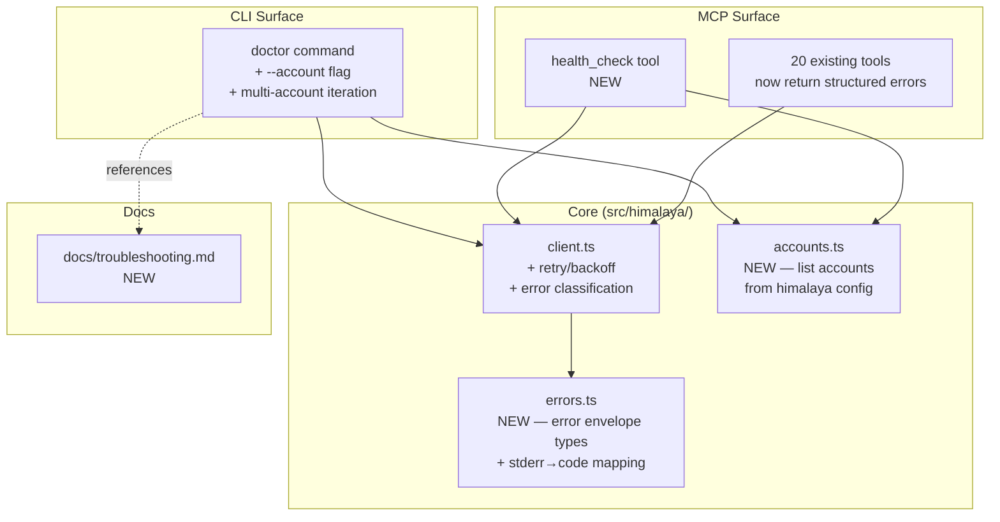

# SPEC: v1.6.0 — Reliability & Diagnostics

**Status:** draft
**Created:** 2026-05-11
**From Brainstorm:** [BRAINSTORM-reliability-dx-2026-05-11.md](./BRAINSTORM-reliability-dx-2026-05-11.md)
**Target release:** v1.6.0 (focused minor)

---

## Overview

Make himalaya-mcp's health-checking and error-reporting **account-aware and actionable**. Today the `doctor` command tests only the default account, and email-tool failures pass raw himalaya stderr through to Claude — which leaves users (and the model) unable to act on errors without dropping out to a terminal.

This release adds multi-account diagnostics, structured error envelopes, transient-failure retry, an MCP-callable `health_check` tool, and a troubleshooting guide.

**Theme:** "Make health-checking and error-reporting account-aware and actionable."

---

## Primary User Story

**As a** himalaya-mcp user with multiple IMAP accounts,
**I want** to know which accounts are healthy and what to do when one fails,
**so that** I can resolve issues without leaving Claude or guessing at cryptic IMAP errors.

### Acceptance Criteria

- [ ] `himalaya-mcp doctor` reports per-account status (table or grouped list), not just the default account
- [ ] `himalaya-mcp doctor --account <name>` runs targeted diagnostics against one account
- [ ] When any email tool fails, the response includes: account name, error code, human-readable hint, and a `recoverable` boolean
- [ ] Claude can invoke a `health_check` MCP tool mid-conversation and receive structured per-account status
- [ ] Transient IMAP errors (`ECONNRESET`, timeout, `* BYE`) auto-retry once with 200 ms backoff before surfacing as failures
- [ ] `docs/troubleshooting.md` exists, is linked from doctor output, and covers the five most common IMAP failure modes
- [ ] All 414 existing tests pass; new tests cover all items above
- [ ] Test count increases by ~50-70 (target: ~465-485 total)
- [ ] New `docs/troubleshooting.md` exists with five failure-mode walkthroughs
- [ ] `docs/architecture.md`, `docs/guide.md`, `docs/REFCARD.md`, `docs/workflows.md`, `README.md`, and the relevant plugin skills all reference the new diagnostics surface

---

## Secondary User Stories

**As a** Claude session,
**I want** structured error metadata when a tool call fails,
**so that** I can suggest specific remediation rather than relaying cryptic stderr.

**As a** new user,
**I want** doctor failures to tell me which command to run next,
**so that** I can debug without reading the himalaya source.

---

## Architecture



### Module Boundaries

| Module | Responsibility | Depends on |
|--------|---------------|-----------|
| `errors.ts` (NEW) | Define `MCPError` envelope type; map himalaya stderr patterns → error codes | none |
| `accounts.ts` (NEW) | Discover and list configured himalaya accounts | filesystem read, himalaya CLI |
| `client.ts` (CHANGED) | Run himalaya subprocess; classify errors via `errors.ts`; retry transients | `errors.ts` |
| `cli/setup.ts` (CHANGED) | Doctor command; per-account iteration; `--account` flag | `accounts.ts`, `client.ts` |
| `tools/health.ts` (NEW) | `health_check` MCP tool registration | `accounts.ts`, `client.ts` |

Each module has one purpose and a documented interface. `errors.ts` has no I/O. `accounts.ts` only reads config. `client.ts` is the single point where subprocess shell-out happens.

---

## New Files

| Path | Purpose | Approx. size |
|------|---------|--------------|
| `src/himalaya/errors.ts` | Error envelope type, stderr-pattern → code mapping, classification helper | ~120 LOC |
| `src/himalaya/accounts.ts` | `listAccounts()` (parse config.toml), `getDefaultAccount()` | ~60 LOC |
| `src/tools/health.ts` | `health_check` MCP tool registration | ~80 LOC |
| `tests/errors.test.ts` | Unit tests for stderr-pattern matching | ~15 tests |
| `tests/accounts.test.ts` | Unit tests for config parsing (fixtures) | ~8 tests |
| `tests/health.test.ts` | Integration tests for `health_check` tool | ~10 tests |
| `tests/retry.test.ts` | Tests for retry/backoff behavior (mock execFile) | ~6 tests |
| `tests/dogfood-reliability.test.ts` | Realistic Claude-usage scenarios for v1.6.0 features (multi-account doctor, health_check, error-recovery flows) | ~20 tests |
| `docs/troubleshooting.md` | User-facing troubleshooting guide | ~200 lines |

## Changed Files

| Path | Change |
|------|--------|
| `src/himalaya/client.ts` | Wrap `execFile` calls in retry/backoff; classify errors before throwing |
| `src/cli/setup.ts` | Add `--account <name>` flag to doctor; loop over accounts when no flag given; render per-account table |
| `src/index.ts` | Register `health_check` tool (1 line) |
| All `src/tools/*.ts` | Catch `MCPError` from client; surface structured envelope in MCP response |
| `tests/setup.test.ts` | Update doctor tests for multi-account output |
| `tests/client.test.ts` | Add tests for retry behavior and error classification |
| `docs/guide.md` | Document `health_check` tool; document `doctor --account` flag; cross-link to troubleshooting.md |
| `docs/REFCARD.md` | Add `health_check` to tool list; add troubleshooting one-liner |
| `docs/architecture.md` | Document `errors.ts` and `accounts.ts` modules; update module map; document retry/backoff policy |
| `docs/workflows.md` | New workflow: "Diagnosing email problems" (when a tool fails → ask Claude to run health_check → act on hint) |
| `README.md` | Update tool count (21→22); mention `health_check` in feature highlights; link to troubleshooting.md |
| `tests/dogfood.test.ts` | Optional: extend existing realistic-usage scenarios to exercise new error envelopes (some scenarios may move to `dogfood-reliability.test.ts`) |
| `himalaya-mcp-plugin/skills/help/SKILL.md` | Reference `health_check` tool and troubleshooting.md so `/email:help` surfaces the new diagnostics path |
| `himalaya-mcp-plugin/skills/config/SKILL.md` | Mention `health_check` as the in-conversation alternative to running `himalaya-mcp doctor` from a terminal |
| `CLAUDE.md` | Bump version to 1.6.0; update tool count (21→22); update test count; add `errors.ts`/`accounts.ts` to module map |
| `CHANGELOG.md` | New section for v1.6.0 (Added: health_check, --account flag, troubleshooting docs; Changed: error envelope, multi-account doctor; Fixed: transient retry) |
| `docs/CHANGELOG.md` | Mirror root CHANGELOG (per release checklist) |
| `.STATUS` | Phase + priority update |
| `package.json` | Version bump to 1.6.0 |
| `src/index.ts` | `VERSION` constant bump to 1.6.0 |

---

## Error Envelope Schema (M2)

```ts
// src/himalaya/errors.ts
export type MCPErrorCode =
  | "imap_connection_failed"
  | "imap_auth_failed"
  | "imap_timeout"
  | "imap_cert_error"
  | "account_not_found"
  | "folder_not_found"
  | "message_not_found"
  | "himalaya_not_installed"
  | "himalaya_config_missing"
  | "transient"           // retried; final failure if surfaced
  | "unknown";            // fallthrough — raw stderr in message

export interface MCPError {
  code: MCPErrorCode;
  message: string;        // human-readable
  hint?: string;          // one-line suggested next action
  account?: string;       // which account, if known
  recoverable: boolean;   // true if user action (re-auth, retry later) might fix
  attempts?: number;      // populated if retry happened
  rawStderr?: string;     // himalaya CLI stderr, for debugging
}
```

### stderr-pattern → code mapping (initial table)

| himalaya stderr substring | code | hint |
|---------------------------|------|------|
| `ECONNRESET`, `ETIMEDOUT`, `* BYE` | `transient` | (retried; if still failing: check network) |
| `AUTHENTICATIONFAILED`, `Invalid credentials` | `imap_auth_failed` | Re-check app password; rerun `himalaya account configure <account>` |
| `certificate verify failed`, `self-signed` | `imap_cert_error` | Check imap-encryption-tls or trust the cert |
| `Cannot find account` | `account_not_found` | Run `himalaya account list` to see configured accounts |
| `No such folder`, `Mailbox doesn't exist` | `folder_not_found` | Run `himalaya folder list` |
| `command not found: himalaya` | `himalaya_not_installed` | `brew install himalaya` |
| `Cannot find config` | `himalaya_config_missing` | Run `himalaya account configure` |
| (no match) | `unknown` | (raw stderr in message) |

**Conservative principle:** when no pattern matches, fall through to `unknown` with raw stderr in `message`. Never swallow information.

---

## Retry Policy (M3)

- **Eligible codes:** `transient` only.
- **Strategy:** one retry, 200 ms backoff (literal `setTimeout`, no jitter for now).
- **Surface:** when retry succeeds, response includes `attempts: 2` in error envelope (which becomes the success path's metadata). When retry fails, error envelope carries `attempts: 2` and `code: transient`.
- **Not retried:** auth failures, cert errors, account/folder/message not found, config missing. These are user-action errors; retrying wastes time and risks lockouts.

---

## health_check Tool (W4)

**MCP tool signature:**

```ts
{
  name: "health_check",
  description: "Check himalaya-mcp installation health and per-account IMAP connectivity. Use when an email tool fails to diagnose which accounts are reachable.",
  inputSchema: {
    account: { type: "string", optional: true, description: "Specific account to test (default: all)" }
  }
}
```

**Output:** JSON matching the per-account table that `doctor` renders, plus an `overall: "healthy" | "degraded" | "broken"` summary.

---

## Documentation Plan

Documentation is a first-class deliverable for this release — the theme is "actionable diagnostics," which only works if users (and Claude) can find the docs from the failure surface.

### New documentation

- **`docs/troubleshooting.md`** (~200 lines, primary new doc)
  - Section 1: How to read the doctor output (per-account table, what each column means)
  - Section 2: Five most common failure modes — for each, the symptom, the error envelope `code`, the underlying cause, and step-by-step remediation:
    1. Expired app password (`imap_auth_failed`)
    2. Network restrictions / VPN required (`transient` after retry)
    3. Certificate trust issues (`imap_cert_error`)
    4. Missing/corrupt himalaya config (`himalaya_config_missing`)
    5. Account renamed or removed in himalaya config (`account_not_found`)
  - Section 3: How to ask Claude for help — example prompts that invoke `health_check`
  - Section 4: When to file an issue vs. fix locally — pointer to GitHub issues template
  - Section 5: Reference table of all `MCPErrorCode` values and their hints

### Documentation cross-linking

Every layer must point users to the next:

```text
tool failure  →  error envelope hint  →  docs/troubleshooting.md  →  GitHub issue
   ↓                ↓                        ↓
health_check     doctor output           Section 2 entry
```

- Doctor output footer (when any account fails): `"See https://github.com/Data-Wise/himalaya-mcp/blob/main/docs/troubleshooting.md"`
- Error envelope `hint` field includes a section anchor when relevant: `"See troubleshooting.md#imap-auth-failed"`
- `docs/guide.md` "When something goes wrong" section links to troubleshooting.md as the canonical reference

### Updated documentation

See "Changed Files" table above for the full list. Key updates:

- **`docs/architecture.md`** — add `errors.ts` and `accounts.ts` to the module map; document the retry policy and stderr-pattern classifier as architectural decisions
- **`docs/workflows.md`** — add a "Diagnosing email problems" workflow showing the full Claude-driven debugging loop
- **Plugin skills (`help`, `config`)** — surface `health_check` and troubleshooting.md so `/email:help` and `/email:config` users discover the new diagnostic path without reading release notes

### Documentation quality gate

- All doc changes pass the existing `Documentation quality checks` pre-commit hook
- Internal links validated (no broken anchors)
- New `docs/troubleshooting.md` referenced from at least: doctor output, error envelope hints, `docs/guide.md`, `README.md`

---

## Testing Plan

### Unit tests

- `tests/errors.test.ts` — every entry in the stderr→code mapping, plus the `unknown` fallthrough
- `tests/accounts.test.ts` — config.toml parsing with fixtures (single account, multi-account, OAuth section ignored, empty config)
- `tests/retry.test.ts` — mock `execFile` to fail once with `ECONNRESET`, succeed on retry; verify `attempts: 2`; verify no retry for `AUTHENTICATIONFAILED`

### Integration tests

- `tests/health.test.ts` — invoke `health_check` tool with mocked himalaya CLI; assert structured response shape
- `tests/setup.test.ts` (extended) — doctor with multi-account fixture; doctor with `--account <name>`; doctor surfaces hints

### Dogfood tests (`tests/dogfood-reliability.test.ts`)

Following the existing `dogfood.test.ts` pattern: simulate realistic Claude-usage flows end-to-end (via MCP server stdin/stdout with mocked himalaya CLI) and assert that the responses give Claude enough information to take the right next action. Each scenario is named for the user intent, not the tool call.

**Scope:** ~20 scenarios covering:

| # | Scenario | What we assert |
|---|----------|----------------|
| 1 | "Check my email" with one account broken, others healthy | `list_emails` works on healthy accounts; failed account returns envelope with account name + hint |
| 2 | "Is email working?" | `health_check` returns multi-account table; overall `degraded` when ≥1 account fails |
| 3 | "List my inbox" hits transient `ECONNRESET` once | Tool succeeds with `attempts: 2`; Claude sees no error |
| 4 | "List my inbox" hits persistent transient failures | Tool fails with `code: transient`, `attempts: 2`, `recoverable: true`; hint suggests network check |
| 5 | "Send this email" with expired app password | Returns `imap_auth_failed`; hint includes `himalaya account configure <account>` |
| 6 | "Check unm account" after seeing degraded status | `health_check --account unm` returns isolated per-account detail with `rawStderr` |
| 7 | "List threads" with cert error | Returns `imap_cert_error`; hint references trust-store remediation |
| 8 | "What's wrong with email?" follow-up after any tool failure | Claude calls `health_check`; envelope surfaces the same `code` it saw on the original failure (consistency check) |
| 9 | Tool failure with unrecognized stderr | Returns `code: unknown`, `rawStderr` populated, `recoverable: false` (conservative default) |
| 10 | Multi-account doctor with mixed states | Output table shows ≥3 accounts: healthy / auth_failed / transient_after_retry |
| 11 | `health_check` invoked with no accounts configured | Returns `himalaya_config_missing`; hint suggests `himalaya account configure` |
| 12 | `health_check` invoked when himalaya binary missing | Returns `himalaya_not_installed`; hint suggests `brew install himalaya` |
| 13 | Folder operation against deleted folder | Returns `folder_not_found`; hint suggests `list_folders` |
| 14 | Read email by ID that no longer exists | Returns `message_not_found`; hint references stale UID |
| 15 | Auth failure should NOT trigger retry | Mock execFile asserted to be called exactly once for `AUTHENTICATIONFAILED` |
| 16 | Transient failure DOES trigger one retry, no more | Mock execFile asserted called exactly twice for persistent `ECONNRESET` |
| 17 | Error envelope serializes cleanly through MCP transport | Round-trip test: server emits envelope → client reads → all fields preserved |
| 18 | `hint` field is human-readable for every `code` | Snapshot test: every `MCPErrorCode` has a non-empty hint |
| 19 | "Why did my morning briefing fail?" | After `morning_briefing` prompt fails on one account, `health_check` identifies which account; user receives both partial briefing AND remediation hint |
| 20 | Backward-compat smoke: a tool that doesn't fail returns the same shape as v1.5.0 | Success path unchanged by error-envelope refactor |

**Why a separate file:** keeping reliability scenarios isolated from the existing 142-scenario `dogfood.test.ts` makes test failures easier to attribute and lets the new file evolve as v1.6.0 patterns mature. Some scenarios may later migrate into the main dogfood suite.

### Manual verification

- Run `himalaya-mcp doctor` against the live config — verify per-account table renders for all configured accounts
- Run `himalaya-mcp doctor --account unm` — verify it isolates the failing account
- Invoke `health_check` from Claude in a real session — verify structured output is useful for follow-up
- Read `docs/troubleshooting.md` cold (as a new user would) — verify each of the 5 failure modes is followable end-to-end
- Click every link in the new docs — verify no 404s

### Regression

- All 414 existing tests must pass unchanged
- Existing tool error paths must continue to work (tools should still throw on error; only the *shape* of the thrown error changes)
- Existing `dogfood.test.ts` (142 tests) must pass without modification, except where success-path response shapes are extended (additive only)

---

## Migration / Backward Compatibility

- **Error envelope** is additive — MCP clients that ignore the new fields see the same human-readable `message` as before.
- **Doctor output format** changes (multi-account table replaces single-account list). The `doctor --account <name>` flag preserves the old single-account view for scripts that grep it.
- **No breaking changes** to existing tool inputs/outputs.

---

## Sequencing (Implementation Order)

| Commit | Scope | Why this order |
|--------|-------|---------------|
| 1 | W5 (`docs/troubleshooting.md` initial draft) + W3 (better failure messages, naïve version using raw stderr) | Lowest risk, docs-first; unblocks user from diagnosing `unm` immediately |
| 2 | M1 (`accounts.ts`) + W2 (`doctor --account` flag, multi-account loop) | Multi-account view depends on `accounts.ts`; bundled |
| 3 | M2 (`errors.ts`, refactor `client.ts` to throw `MCPError`); update all tools | Foundational refactor; biggest test impact |
| 4 | M3 (retry/backoff in `client.ts`) | Builds on M2's error classification |
| 5 | W4 (`health_check` tool) | Wraps everything above as an MCP-callable surface |
| 6 | `tests/dogfood-reliability.test.ts` (~20 scenarios) | End-to-end verification that the surface composes correctly from a Claude-usage perspective |
| 7 | Documentation pass: finalize `docs/troubleshooting.md`, update `architecture.md`, `guide.md`, `REFCARD.md`, `workflows.md`, `README.md`, plugin skills (`help`, `config`) | Docs benefit from being written *after* the code stabilizes; cross-linking is a single coherent edit |
| 8 | Release prep: version bump (CLAUDE.md, CHANGELOG.md, docs/CHANGELOG.md, .STATUS, package.json, src/index.ts) | Final step before opening PR |

One feature branch (`feature/v1.6.0-reliability`), eight commits, one PR to `dev`.

---

## Open Questions

1. **Doctor output format** — JSON-by-default or human-readable-by-default with `--json` flag? (Recommend: human-readable default, `--json` flag for scripts. Matches existing convention.)
2. **`health_check` security** — should it expose raw stderr to the Claude conversation, or sanitize first? (Recommend: include `rawStderr` so Claude can help debug; rely on stderr never containing email content.)
3. **`accounts.ts` config source** — parse `~/.config/himalaya/config.toml` directly, or shell out to `himalaya account list -o json`? (Recommend: `himalaya account list -o json` — already wraps the parsing logic, less duplication.)

Resolve these in the first commit's PR description, not before starting work.

---

## Out of Scope (Explicitly)

- OAuth refresh tooling (no OAuth accounts in use)
- Performance work: caching, persistent IMAP session, native bindings
- `SPEC-installation-enhancement-2026-02-25` (separate spec)
- Telemetry / event log
- First-run wizard prompt

These remain valid future work but do not belong to v1.6.0.

---

## Definition of Done

- All acceptance criteria in the Primary User Story check off
- PR to `dev` green: lint, tsc, build, test all pass
- `npm test` shows ~445-465 tests passing
- `himalaya-mcp doctor` on local install renders multi-account table
- CHANGELOG.md and docs/CHANGELOG.md updated and in sync
- Version bumped consistently across `package.json`, `src/index.ts`, `CLAUDE.md`, `.STATUS`
- PR from `dev` to `main` opens cleanly (release flow)
