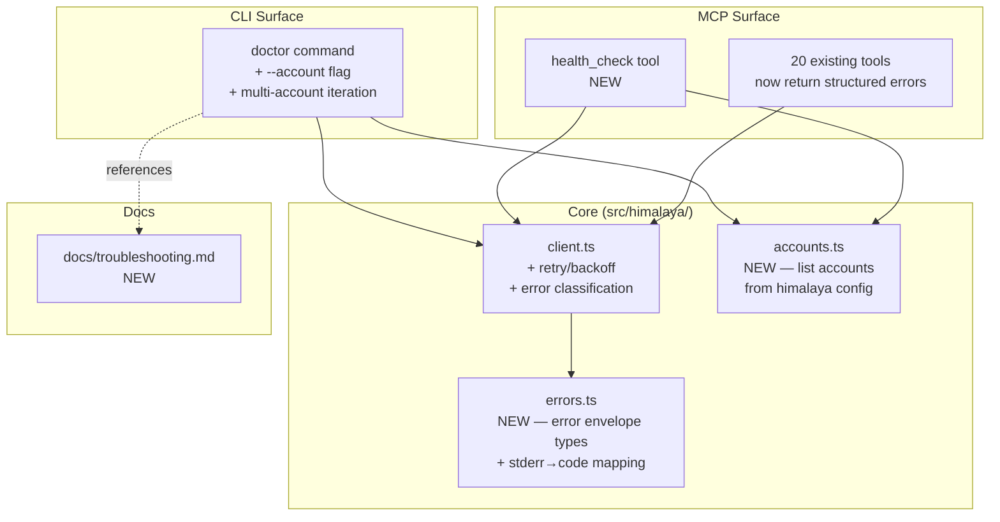

# SPEC: v1.6.0 — Reliability & Diagnostics

**Status:** draft
**Created:** 2026-05-11
**From Brainstorm:** [BRAINSTORM-reliability-dx-2026-05-11.md](./BRAINSTORM-reliability-dx-2026-05-11.md)
**Target release:** v1.6.0 (focused minor)

---

## Overview

Make himalaya-mcp's health-checking and error-reporting **account-aware and actionable**. Today the `doctor` command tests only the default account, and email-tool failures pass raw himalaya stderr through to Claude — which leaves users (and the model) unable to act on errors without dropping out to a terminal.

This release adds multi-account diagnostics, structured error envelopes, transient-failure retry, an MCP-callable `health_check` tool, and a troubleshooting guide.

**Theme:** "Make health-checking and error-reporting account-aware and actionable."

---

## Primary User Story

**As a** himalaya-mcp user with multiple IMAP accounts,
**I want** to know which accounts are healthy and what to do when one fails,
**so that** I can resolve issues without leaving Claude or guessing at cryptic IMAP errors.

### Acceptance Criteria

- [ ] `himalaya-mcp doctor` reports per-account status (table or grouped list), not just the default account
- [ ] `himalaya-mcp doctor --account <name>` runs targeted diagnostics against one account
- [ ] When any email tool fails, the response includes: account name, error code, human-readable hint, and a `recoverable` boolean
- [ ] Claude can invoke a `health_check` MCP tool mid-conversation and receive structured per-account status
- [ ] Transient IMAP errors (`ECONNRESET`, timeout, `* BYE`) auto-retry once with 200 ms backoff before surfacing as failures
- [ ] `docs/troubleshooting.md` exists, is linked from doctor output, and covers the five most common IMAP failure modes
- [ ] All 414 existing tests pass; new tests cover all items above
- [ ] Test count increases by ~30-50 (target: ~445-465 total)

---

## Secondary User Stories

**As a** Claude session,
**I want** structured error metadata when a tool call fails,
**so that** I can suggest specific remediation rather than relaying cryptic stderr.

**As a** new user,
**I want** doctor failures to tell me which command to run next,
**so that** I can debug without reading the himalaya source.

---

## Architecture



### Module Boundaries

| Module | Responsibility | Depends on |
|--------|---------------|-----------|
| `errors.ts` (NEW) | Define `MCPError` envelope type; map himalaya stderr patterns → error codes | none |
| `accounts.ts` (NEW) | Discover and list configured himalaya accounts | filesystem read, himalaya CLI |
| `client.ts` (CHANGED) | Run himalaya subprocess; classify errors via `errors.ts`; retry transients | `errors.ts` |
| `cli/setup.ts` (CHANGED) | Doctor command; per-account iteration; `--account` flag | `accounts.ts`, `client.ts` |
| `tools/health.ts` (NEW) | `health_check` MCP tool registration | `accounts.ts`, `client.ts` |

Each module has one purpose and a documented interface. `errors.ts` has no I/O. `accounts.ts` only reads config. `client.ts` is the single point where subprocess shell-out happens.

---

## New Files

| Path | Purpose | Approx. size |
|------|---------|--------------|
| `src/himalaya/errors.ts` | Error envelope type, stderr-pattern → code mapping, classification helper | ~120 LOC |
| `src/himalaya/accounts.ts` | `listAccounts()` (parse config.toml), `getDefaultAccount()` | ~60 LOC |
| `src/tools/health.ts` | `health_check` MCP tool registration | ~80 LOC |
| `tests/errors.test.ts` | Unit tests for stderr-pattern matching | ~15 tests |
| `tests/accounts.test.ts` | Unit tests for config parsing (fixtures) | ~8 tests |
| `tests/health.test.ts` | Integration tests for `health_check` tool | ~10 tests |
| `tests/retry.test.ts` | Tests for retry/backoff behavior (mock execFile) | ~6 tests |
| `docs/troubleshooting.md` | User-facing troubleshooting guide | ~200 lines |

## Changed Files

| Path | Change |
|------|--------|
| `src/himalaya/client.ts` | Wrap `execFile` calls in retry/backoff; classify errors before throwing |
| `src/cli/setup.ts` | Add `--account <name>` flag to doctor; loop over accounts when no flag given; render per-account table |
| `src/index.ts` | Register `health_check` tool (1 line) |
| All `src/tools/*.ts` | Catch `MCPError` from client; surface structured envelope in MCP response |
| `tests/setup.test.ts` | Update doctor tests for multi-account output |
| `tests/client.test.ts` | Add tests for retry behavior and error classification |
| `docs/guide.md` | Reference troubleshooting doc; document `health_check` tool |
| `CLAUDE.md` | Bump version to 1.6.0; update tool count (21→22); update test count |
| `CHANGELOG.md` | New section for v1.6.0 |
| `docs/CHANGELOG.md` | Mirror root CHANGELOG (per release checklist) |
| `package.json` | Version bump to 1.6.0 |
| `src/index.ts` | `VERSION` constant bump to 1.6.0 |

---

## Error Envelope Schema (M2)

```ts
// src/himalaya/errors.ts
export type MCPErrorCode =
  | "imap_connection_failed"
  | "imap_auth_failed"
  | "imap_timeout"
  | "imap_cert_error"
  | "account_not_found"
  | "folder_not_found"
  | "message_not_found"
  | "himalaya_not_installed"
  | "himalaya_config_missing"
  | "transient"           // retried; final failure if surfaced
  | "unknown";            // fallthrough — raw stderr in message

export interface MCPError {
  code: MCPErrorCode;
  message: string;        // human-readable
  hint?: string;          // one-line suggested next action
  account?: string;       // which account, if known
  recoverable: boolean;   // true if user action (re-auth, retry later) might fix
  attempts?: number;      // populated if retry happened
  rawStderr?: string;     // himalaya CLI stderr, for debugging
}
```

### stderr-pattern → code mapping (initial table)

| himalaya stderr substring | code | hint |
|---------------------------|------|------|
| `ECONNRESET`, `ETIMEDOUT`, `* BYE` | `transient` | (retried; if still failing: check network) |
| `AUTHENTICATIONFAILED`, `Invalid credentials` | `imap_auth_failed` | Re-check app password; rerun `himalaya account configure <account>` |
| `certificate verify failed`, `self-signed` | `imap_cert_error` | Check imap-encryption-tls or trust the cert |
| `Cannot find account` | `account_not_found` | Run `himalaya account list` to see configured accounts |
| `No such folder`, `Mailbox doesn't exist` | `folder_not_found` | Run `himalaya folder list` |
| `command not found: himalaya` | `himalaya_not_installed` | `brew install himalaya` |
| `Cannot find config` | `himalaya_config_missing` | Run `himalaya account configure` |
| (no match) | `unknown` | (raw stderr in message) |

**Conservative principle:** when no pattern matches, fall through to `unknown` with raw stderr in `message`. Never swallow information.

---

## Retry Policy (M3)

- **Eligible codes:** `transient` only.
- **Strategy:** one retry, 200 ms backoff (literal `setTimeout`, no jitter for now).
- **Surface:** when retry succeeds, response includes `attempts: 2` in error envelope (which becomes the success path's metadata). When retry fails, error envelope carries `attempts: 2` and `code: transient`.
- **Not retried:** auth failures, cert errors, account/folder/message not found, config missing. These are user-action errors; retrying wastes time and risks lockouts.

---

## health_check Tool (W4)

**MCP tool signature:**

```ts
{
  name: "health_check",
  description: "Check himalaya-mcp installation health and per-account IMAP connectivity. Use when an email tool fails to diagnose which accounts are reachable.",
  inputSchema: {
    account: { type: "string", optional: true, description: "Specific account to test (default: all)" }
  }
}
```

**Output:** JSON matching the per-account table that `doctor` renders, plus an `overall: "healthy" | "degraded" | "broken"` summary.

---

## Testing Plan

### Unit tests

- `tests/errors.test.ts` — every entry in the stderr→code mapping, plus the `unknown` fallthrough
- `tests/accounts.test.ts` — config.toml parsing with fixtures (single account, multi-account, OAuth section ignored, empty config)
- `tests/retry.test.ts` — mock `execFile` to fail once with `ECONNRESET`, succeed on retry; verify `attempts: 2`; verify no retry for `AUTHENTICATIONFAILED`

### Integration tests

- `tests/health.test.ts` — invoke `health_check` tool with mocked himalaya CLI; assert structured response shape
- `tests/setup.test.ts` (extended) — doctor with multi-account fixture; doctor with `--account <name>`; doctor surfaces hints

### Manual verification

- Run `himalaya-mcp doctor` against the live config — verify per-account table renders for all configured accounts
- Run `himalaya-mcp doctor --account unm` — verify it isolates the failing account
- Invoke `health_check` from Claude in a real session — verify structured output is useful for follow-up

### Regression

- All 414 existing tests must pass unchanged
- Existing tool error paths must continue to work (tools should still throw on error; only the *shape* of the thrown error changes)

---

## Migration / Backward Compatibility

- **Error envelope** is additive — MCP clients that ignore the new fields see the same human-readable `message` as before.
- **Doctor output format** changes (multi-account table replaces single-account list). The `doctor --account <name>` flag preserves the old single-account view for scripts that grep it.
- **No breaking changes** to existing tool inputs/outputs.

---

## Sequencing (Implementation Order)

| Commit | Scope | Why this order |
|--------|-------|---------------|
| 1 | W5 (`docs/troubleshooting.md`) + W3 (better failure messages, naïve version using raw stderr) | Lowest risk, docs-first; unblocks user from diagnosing `unm` immediately |
| 2 | M1 (`accounts.ts`) + W2 (`doctor --account` flag, multi-account loop) | Multi-account view depends on `accounts.ts`; bundled |
| 3 | M2 (`errors.ts`, refactor `client.ts` to throw `MCPError`); update all tools | Foundational refactor; biggest test impact |
| 4 | M3 (retry/backoff in `client.ts`) | Builds on M2's error classification |
| 5 | W4 (`health_check` tool) | Wraps everything above as an MCP-callable surface |
| 6 | Docs + version bump (CLAUDE.md, CHANGELOG.md, docs/CHANGELOG.md, package.json, src/index.ts) | Release prep |

One feature branch (`feature/v1.6.0-reliability`), six commits, one PR to `dev`.

---

## Open Questions

1. **Doctor output format** — JSON-by-default or human-readable-by-default with `--json` flag? (Recommend: human-readable default, `--json` flag for scripts. Matches existing convention.)
2. **`health_check` security** — should it expose raw stderr to the Claude conversation, or sanitize first? (Recommend: include `rawStderr` so Claude can help debug; rely on stderr never containing email content.)
3. **`accounts.ts` config source** — parse `~/.config/himalaya/config.toml` directly, or shell out to `himalaya account list -o json`? (Recommend: `himalaya account list -o json` — already wraps the parsing logic, less duplication.)

Resolve these in the first commit's PR description, not before starting work.

---

## Out of Scope (Explicitly)

- OAuth refresh tooling (no OAuth accounts in use)
- Performance work: caching, persistent IMAP session, native bindings
- `SPEC-installation-enhancement-2026-02-25` (separate spec)
- Telemetry / event log
- First-run wizard prompt

These remain valid future work but do not belong to v1.6.0.

---

## Definition of Done

- All acceptance criteria in the Primary User Story check off
- PR to `dev` green: lint, tsc, build, test all pass
- `npm test` shows ~445-465 tests passing
- `himalaya-mcp doctor` on local install renders multi-account table
- CHANGELOG.md and docs/CHANGELOG.md updated and in sync
- Version bumped consistently across `package.json`, `src/index.ts`, `CLAUDE.md`, `.STATUS`
- PR from `dev` to `main` opens cleanly (release flow)
