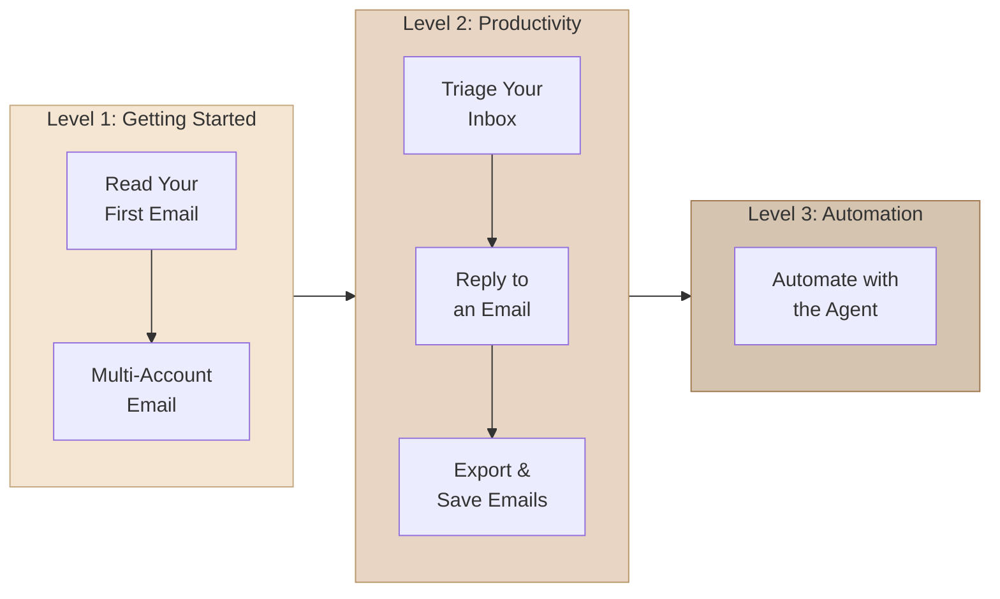

# Tutorials

Step-by-step guides from simple to advanced. Each tutorial builds on the previous one -- start at Level 1 and work your way up.

## Learning Path

## Tutorials by Level

### Level 1: Getting Started

Get comfortable reading and navigating your email through Claude.

| Tutorial | Time | What You'll Learn |
|----------|------|-------------------|
| [Read Your First Email](read-first-email.md) | 2 min | List inbox, read messages, HTML vs plain text |
| [Multi-Account Email](multi-account.md) | 3 min | Switch accounts, cross-account queries, defaults |

### Level 2: Productivity

Organize, reply, and export emails efficiently.

| Tutorial | Time | Prerequisites |
|----------|------|---------------|
| [Triage Your Inbox](triage-inbox.md) | 5 min | Level 1 |
| [Reply to an Email](reply-email.md) | 5 min | Level 1 |
| [Export and Save Emails](export-save.md) | 3 min | Level 1 |

### Level 3: Automation

Let the email-assistant agent handle your entire inbox workflow.

| Tutorial | Time | Prerequisites |
|----------|------|---------------|
| [Automate with the Agent](automate-agent.md) | 10 min | Level 2 |

---

**Total learning time:** ~28 minutes from zero to full automation.

**Prerequisites:** [Installation](../getting-started/installation.md) complete and himalaya CLI configured with at least one email account.
